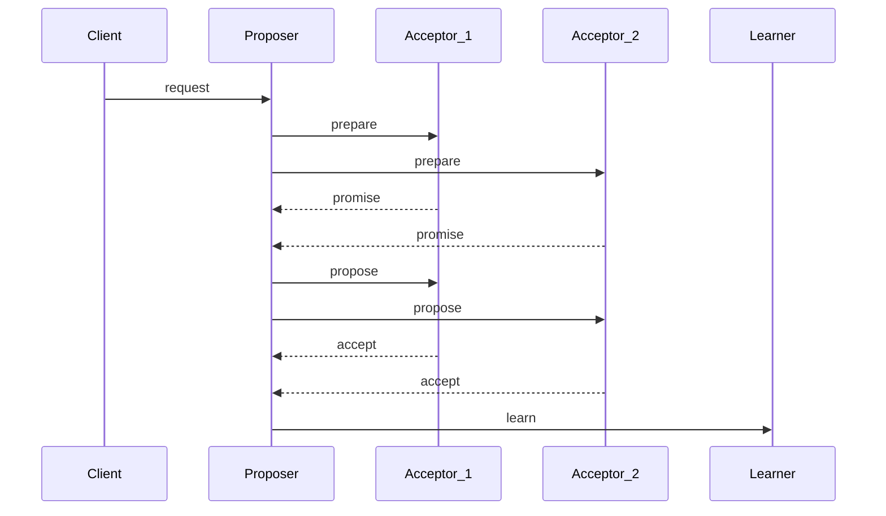

## Description
This is an implementation of distributed key value database with paxos algorithm with replicated logs.

## Usage
- pip install -r requirements.txt
- run `python paxos_kv/main.py paxo
s_kv/config/config1.json`
- do the same for `config2`, `config3` and `config4`
- put request: post to url: `http://0.0.0.0:8081/propose_request_put` msg: `{"key": "id", "value": "1234"}`
- get request: post to url: `http://0.0.0.0:8080/propose_request_get`
msg: `{"key": "id"}`

## Design

### Sequence Diagram

### Consensus
minimum votes: N/2 + 1 where N is total number of nodes